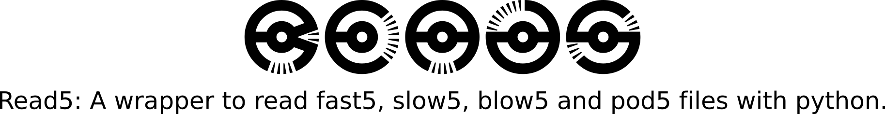

# 

- **Read5** is a python wrapper to read fast5, slow5/blow5 and pod5 files using the same overloaded functions from different APIs. 
- **Read5_ont** is a python wrapper to read fast5 and pod5 files using the same overloaded functions from different APIs. 

[](https://www.gnu.org/licenses/gpl-3.0)

[  ](https://pypi.org/project/read5/)


[](https://anaconda.org/jannessp/read5)  [](https://anaconda.org/jannessp/read5) [](https://anaconda.org/jannessp/read5)
 
[](https://zenodo.org/badge/latestdoi/633012569)

[](https://twitter.com/Ja_Spangenberg)
___
## Table of Content
1.  [Installation](#installation)
2.  [Usage](#usage)
3.  [Full Documentation](https://jannessp.github.io/read5.github.io/)
___
## Installation

### Pypi/pip
```bash
pip install read5
# or
pip install read5_ont
```
### Conda
Pod5 is now available via [conda](https://anaconda.org/jannessp/pod5) (19.07.2023).

```bash
conda install mamba
mamba create -n read5 -c jannessp read5
conda activate read5
# or
mamba create -n read5_ont -c jannessp read5_ont
conda activate read5_ont
```
Alternatively you can create the environment using the [conda.recipe/env.yml](conda.recipe/env.yml) file.
```bash
conda install mamba
mamba env create -f conda.recipe/env.yml
conda activate read5
```
___
## Usage

[Click here to see a full documentation about the classes and function.](https://jannessp.github.io/read5.github.io/)

*my_file* can be a fast5, slow5, blow5 or pod5 file. The wrapper detects the file format depending on the file extension.

### Small example:

```python
from read5 import read # or from read5.Reader import read

r5 = read(my_file) # file with on of these extensions: .fast5, .slow5, .blow5, .pod5
for readid in r5:
    signal = r5.getSignal(readid) # returns raw integer values stored in the file
    pA_signal = r5.getpASignal(readid) # returns pA signal
    norm_signal = r5.getZNormSignal(readid) # returns normalised read signal: norm_signal = (signal - median(signal)) / mad(signal)
    channel = r5.getChannelNumber(readid)
    sampleid = r5.getSampleID(readid)
    runid = r5.getRunID(readid)

readid_list = r5.getReads()
```

### File Reader Classes
If you want to use the file readers you can import the corresponding class like this:

```python
from read5.Fast5Reader import Fast5Reader # contains the Fast5 Reader class
from read5.Slow5Reader import Slow5Reader # contains the Slow5 Reader class - !not available in read5_ont!
from read5.Pod5Reader import Pod5Reader # contains the Pod5 Reader class
```

### Abstract File Reader Class

```python
from read5.AbstractFileReader import AbstractFileReader
```

### Possible Exceptions

```python
from read5.Exceptions import UnknownFileFormatException, UnknownNormalizationMode
```

- UnknownFileFormatException: is raised, when the file extension does not match one of ['.fast5', '.slow5', '.blow5', '.pod5'] (or ['.fast5', '.pod5'] in **read5_ont**)
- UnknownNormalizationMode: is raised, when an unknown mode is provided for the signal normalization function

## Full Documentation
Created with [pdoc3](https://pdoc3.github.io/pdoc/).
Can be found [here](https://jannessp.github.io/read5.github.io/).
